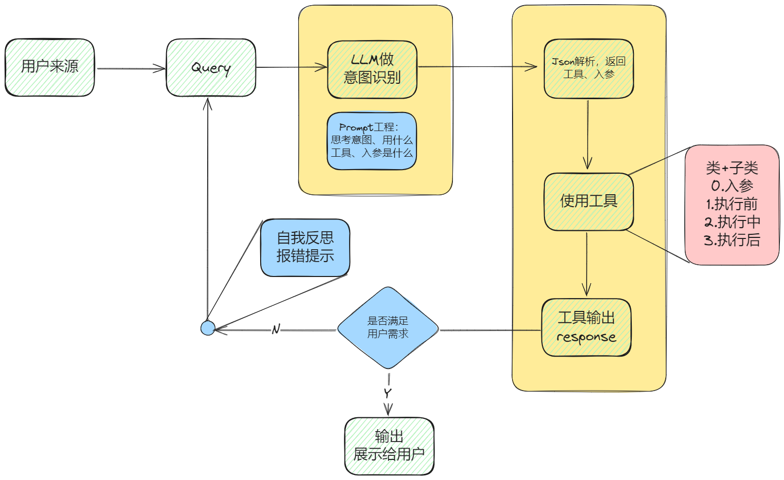

# Mini-Easy-Agent

本项目最小化了实现一个自定义LLM+Agent方案，利用LLM制作属于自己的agent😀

整体流程图如下：



## 介绍 📚

Agent作为一种能够自主感知环境、做出决策并执行行动的软件系统，正变得越来越重要，其广泛应用于自动化任务、数据分析、用户交互等领域。本项目主要是用于学习使用，尽可能简单地设计一款最小化Agent，能够满足用户常见需求。

## LLM使用与部署 🚀

- **支持离线部署**：使用lmdeploy进行，更多见参考部分，本地CPU/GPU需要满足对应的部署条件。
- **支持线上接口调用**：需要自定义api-key。

## 快速开始 🏃‍♂️

1. **安装**

   ```sh
   git clone 本项目
   pip install -r requirements.txt
   ```

2. **启动LLM**

- **方式1**：使用本地启动，需要提前下载好对应的大模型到本地，同时安装好lmdeploy依赖。

     ```sh
     sh start_llm.sh
     ```

- **方式2**：使用线上接口

     ```python
     '''需要更新./brain/Agent.py中的下面三个参数'''
     self.api_key =   'LOCAL_LLM'                # 'sk-xxx'  本地则使用LOCAL_LLM
     self.base_url =  "http://0.0.0.0:23333/v1"  # 如'https://api.deepseek.com'
     self.model_name = 'Qwen/Qwen2-7B-Instruct'  # 如'deepseek-chat'
     ```

3. **执行main函数**

   ```sh
   python main.py
   ```

## 一些规划方向 🌟

该项目已实现并打算未来实现如下功能：

| 说明                                 | 完成 | 备注                                               |
| ------------------------------------ | ---- | -------------------------------------------------- |
| 项目流程图初版制定                   | ✅    |                                                    |
| 文件读写                             | ✅    | 读取Prompt用的类                                   |
| systemPrompt编写                     | ✅    | 常用Prompt编写                                     |
| Agent类的构建                        | ✅    | 核心类                                             |
| Tool类的构建                         | ✅    | 核心类                                             |
| 输出颜色构建                         | ✅    |                                                    |
| 工具：基本对话response               | ✅    |                                                    |
| 工具：天气查询get_weather            | ✅    |                                                    |
| 工具：代码执行（python和terminal）   | ✅    | 仅支持python和terminal                             |
| 工具：文件读取与解读file_reader      | ✅    | 仅读取文本文件如md                                 |
| 循环跳出规则制定（用户需求满足判断） | ✅    | 出于LLM能力考虑，有时候会出现bug，需要强制退出循环 |
| 构建固定首位队列的数据结构           | ✅    |                                                    |
| 记忆与存储                           | ❌    | 即将实现                                           |
| 工具：网页抓取与自动解析             | ❌    | 用户提供url                                        |

## 参考&致谢 🙏

特别感谢以下项目为本项目提供灵感和技术支持：

- [Agent-zero](https://github.com/frdel/agent-zero)
- [lmdeploy](https://github.com/InternLM/lmdeploy)

